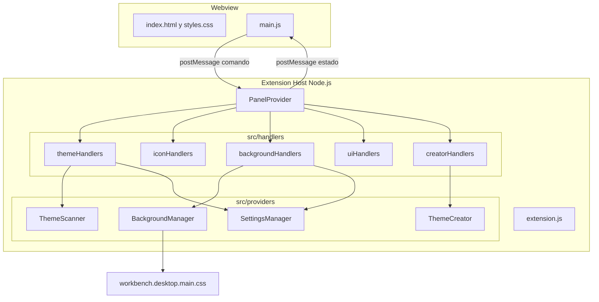
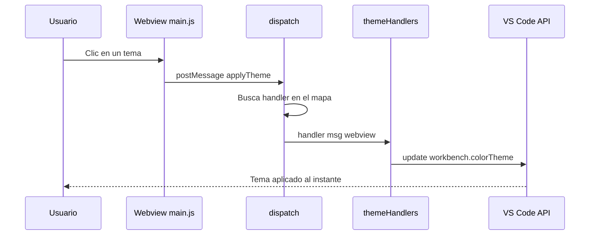

<div align="center">

# 🎨 Theme Manager

**La extensión de personalización visual definitiva para VS Code / Antigravity IDE**

[](https://github.com/leostriker111/theme-manager)
[](./LICENSE)
[](https://code.visualstudio.com)
[](./src)

*Sin frameworks. Sin dependencias. Solo velocidad.*

</div>

---

## ¿Qué es esto?

Theme Manager es un panel integrado en la barra lateral de VS Code que reemplaza por completo la tediosa navegación por menús para cambiar temas. Permite cambiar temas de color e iconos con un clic, aplicar imágenes de fondo al IDE, ajustar tamaños y componentes de la interfaz en vivo, y crear temas personalizados desde cero o copiando uno existente. Todo desde un solo lugar, con cambios instantáneos.

> **📖 Para diagramas interactivos:** Este README usa [Mermaid](https://mermaid.js.org) para los diagramas de arquitectura. GitHub los renderiza automáticamente. Para verlos en local, usa la extensión [Mermaid Preview](https://marketplace.visualstudio.com/items?itemName=bierner.markdown-mermaid) en VS Code o abre el archivo en [mermaid.live](https://mermaid.live).

---

## Tabla de Contenidos

- [Características](#-características)
- [Instalación](#-instalación)
- [Uso](#-uso)
- [Arquitectura](#-arquitectura)
- [Estructura del Proyecto](#-estructura-del-proyecto)
- [Documentación Técnica](#-documentación-técnica)
- [Advertencia sobre Fondos](#️-advertencia-importante-sobre-fondos)
- [Contribuir](#-contribuir)
- [Licencia](#-licencia)

---

## ✨ Características

### 🌈 Temas de Color — Galería Completa

Todos los temas instalados en tu IDE aparecen agrupados por extensión. Un clic aplica el tema al instante, sin recargar nada. Incluye:

- **⭐ Favoritos** — Marca los temas que más usas y filtra solo entre ellos.
- **🏷️ Etiquetas** — Añade tags personalizados (ej. `#trabajo`, `#oscuro`) para agrupar y buscar temas a tu gusto.
- **🔍 Búsqueda inteligente** — Filtra por nombre de tema o por etiqueta usando `#`.
- **🎲 Modo Aleatorio** — Aplica un tema al azar. Puede restringirse solo a tus favoritos.

### 🖼️ Imagen de Fondo

Pon cualquier imagen de tu computadora como fondo del editor (PNG, JPG, GIF, WebP). La imagen se inyecta detrás de todos los paneles del IDE con la opacidad que tú elijas. Incluye un **Interruptor Maestro** para activar y desactivar la inyección de forma limpia y segura.

### 🔧 Personalización UI en Vivo

Ajusta estos parámetros del IDE sin tocar `settings.json`, con efecto inmediato:

| Control                          | Setting de VS Code                  |
| -------------------------------- | ----------------------------------- |
| Tamaño de fuente del editor     | `editor.fontSize`                 |
| Tamaño de fuente de la terminal | `terminal.integrated.fontSize`    |
| Zoom general de la interfaz      | `window.zoomLevel`                |
| Ancho de scrollbars              | `editor.scrollbar.*ScrollbarSize` |
| Alto de línea                   | `editor.lineHeight`               |
| Familia de fuente                | `editor.fontFamily`               |
| Minimapa                         | `editor.minimap.enabled`          |
| Barra de menú                   | `window.menuBarVisibility`        |
| Barra de actividad               | `workbench.activityBar.location`  |
| Status bar                       | `workbench.statusBar.visible`     |

### ✏️ Creador de Temas

Diseña tu propio tema de color ajustando los 8 tokens principales del editor: fondo, texto, sidebar, botones, barra de título, terminal, línea activa y hover de listas. Puedes partir desde cero o copiar cualquier tema instalado como base.

---

## 🚀 Instalación

### Desde un archivo `.vsix` (recomendado)

```bash
# En la terminal de VS Code
code --install-extension theme-manager-by-leostriker-3.4.0.vsix
```

O desde la UI: `Extensiones → ··· → Instalar desde VSIX...`

### Desde el Marketplace

Busca **"Theme Manager By Leostriker"** en el Marketplace de extensiones de VS Code.

---

## 🧭 Uso

Al instalar la extensión, aparece el ícono 🎨 en la barra de actividad. Al hacer clic se abre el panel con 5 pestañas:

| Pestaña            | Función                                             |
| ------------------- | ---------------------------------------------------- |
| 🎨**Temas**   | Galería de temas de color con favoritos y etiquetas |
| 🗂**Iconos**  | Galería de packs de iconos                          |
| 🖼**Fondo**   | Imagen de fondo + Master Switch                      |
| 🔧**UI**      | Controles de tamaño y visibilidad                   |
| ✏️**Crear** | Creador de temas personalizados                      |

---

## 🏗️ Arquitectura

El sistema sigue el patrón **Webview ↔ Extension Host** de VS Code. El webview (HTML/CSS/JS puro) se comunica con el proceso de extensión mediante mensajes `postMessage`. Cada mensaje se enruta a un handler de dominio especializado.



### Flujo de un mensaje

Cuando el usuario hace clic en "Aplicar tema" en la UI, el flujo exacto es:



### Por qué Vanilla JS y no React/Svelte

VS Code recomienda mantener las extensiones ligeras. Cada framework de UI añade un paso de compilación, aumenta el tiempo de activación y añade cientos de KB al bundle. Como el panel es relativamente simple y está bien segmentado en módulos, Vanilla JS con módulos ES da la mejor relación velocidad/mantenibilidad. Si el proyecto creciera significativamente (ej. > 20 controles dinámicos), Svelte sería el candidato natural por su compilación a JS puro sin runtime.

---

## 📁 Estructura del Proyecto

```
theme-manager/
│
├── 📄 package.json               # Manifiesto: comandos, vistas, settings registrados
├── 📄 README.md                  # Este archivo
├── 📄 LICENSE                    # MIT
│
├── src/
│   ├── 📄 extension.js           # Punto de entrada: activate() y deactivate()
│   │
│   ├── providers/                # Módulos de lógica de negocio
│   │   ├── PanelProvider.js      # Orquestador del Webview (ciclo de vida + despacho)
│   │   ├── ThemeScanner.js       # Escanea extensiones instaladas para extraer temas/iconos
│   │   ├── ThemeCreator.js       # Gestiona archivos JSON de temas personalizados
│   │   ├── BackgroundManager.js  # Inyecta/remueve CSS en workbench.desktop.main.css
│   │   └── SettingsManager.js    # Lee/escribe la configuración persistida de la extensión
│   │
│   ├── handlers/                 # Un archivo por dominio de UI — aquí se añaden nuevos botones
│   │   ├── themeHandlers.js      # Handlers: applyTheme, toggleFavorite, tags
│   │   ├── iconHandlers.js       # Handlers: applyIconTheme
│   │   ├── backgroundHandlers.js # Handlers: applyBg, removeBg, masterSwitch, filePicker
│   │   ├── uiHandlers.js         # Handlers: updateUISettings (usa SETTINGS_MAP declarativo)
│   │   └── creatorHandlers.js    # Handlers: saveCustomTheme, loadThemeColors, requestState
│   │
│   └── webview/                  # Frontend del panel (sin framework, sin build step)
│       ├── index.html            # Estructura HTML con marcadores {{nonce}}, {{cssUri}}, etc.
│       ├── styles.css            # Estilos: glassmorphism, variables del tema activo de VS Code
│       └── main.js               # Lógica del panel: renderizado, eventos, comunicación
│
├── assets/
│   ├── icon.png                  # Ícono de la extensión (128x128)
│   └── icons/
│       └── palette.svg           # Ícono de la barra de actividad
│
└── docs/                         # Documentación técnica interna (no se empaqueta en el .vsix)
    ├── refactor_log.md           # Registro cronológico de decisiones técnicas
    └── auditoria_v3.3.2_a_v3.4.0.md  # Auditoría completa de la versión 3.4.0
```

---

## 📚 Documentación Técnica

Para quienes quieran entender el código a fondo o contribuir, la carpeta `docs/` contiene:

- **[`refactor_log.md`](./docs/refactor_log.md)** — Registro técnico de todas las decisiones de diseño tomadas durante la refactorización (Fases 1, 2 y 3). Explica *por qué* se eligió cada patrón, no solo *qué* se hizo.
- **[`auditoria_v3.3.2_a_v3.4.0.md`](./docs/auditoria_v3.3.2_a_v3.4.0.md)** — Auditoría exhaustiva del código: hallazgos por archivo, bugs encontrados y corregidos, y el plan de la arquitectura de handlers.

### Cómo añadir un botón nuevo

Agregar una funcionalidad nueva al panel en v3.4.0 sigue exactamente estos pasos, sin tocar el orquestador:

1. **Añadir el elemento en `src/webview/index.html`** con su `id` único.
2. **Conectar el evento en `src/webview/main.js`** para que envíe `postMessage({ command: 'miNuevoComando', ... })`.
3. **Añadir el handler en el archivo de su dominio** en `src/handlers/`. Por ejemplo, si es un control de UI, agregar una línea en el `SETTINGS_MAP` de `uiHandlers.js`. Si es algo nuevo, crear `src/handlers/miDominio.js`.
4. **Si creaste un archivo nuevo**, importarlo y fusionarlo en `PanelProvider._buildHandlers()` con `Object.assign(...)`.

El `PanelProvider.js` nunca crece con nuevos botones.

---

## ⚠️ Advertencia Importante sobre Fondos

La función de imagen de fondo modifica directamente el archivo `workbench.desktop.main.css` dentro de la carpeta de instalación de VS Code. Este es el único mecanismo disponible públicamente para lograr este efecto en VS Code.

**Implicaciones que debes conocer:**

- VS Code mostrará un aviso de "instalación corrupta" la primera vez. Esto es cosmético y no afecta el funcionamiento.
- La primera vez que aplicas un fondo, se crea un backup del CSS original en `~/Documents/ThemeManager_CSS_Backup_ORIGINAL.css`.
- Para restaurar completamente: usa el **Interruptor Maestro** o el comando `Theme Manager: Quitar imagen de fondo` desde la paleta de comandos (`Ctrl+Shift+P`).
- Al desinstalar o desactivar la extensión, `deactivate()` limpia automáticamente las inyecciones.
- **Requiere ejecutar VS Code como Administrador** en Windows la primera vez si el IDE está instalado en `Program Files`.

---

## 🤝 Contribuir

Las contribuciones son bienvenidas. Por favor:

1. Haz un fork del repositorio.
2. Crea una rama descriptiva: `git checkout -b feature/mi-nueva-funcionalidad`.
3. Revisa `docs/refactor_log.md` para entender los patrones de diseño establecidos.
4. Para agregar funcionalidades, sigue la guía [Cómo añadir un botón nuevo](#cómo-añadir-un-botón-nuevo).
5. Abre un Pull Request describiendo el problema que resuelve.

---

## 📄 Licencia

Distribuido bajo la licencia **MIT**. Consulta el archivo [LICENSE](./LICENSE) para más información.

---

<div align="center">

Hecho con ❤️ y mucho café por **[Leostriker111](https://github.com/leostriker111)**

*"El mejor IDE es el que parece hecho a tu medida."*

</div>
