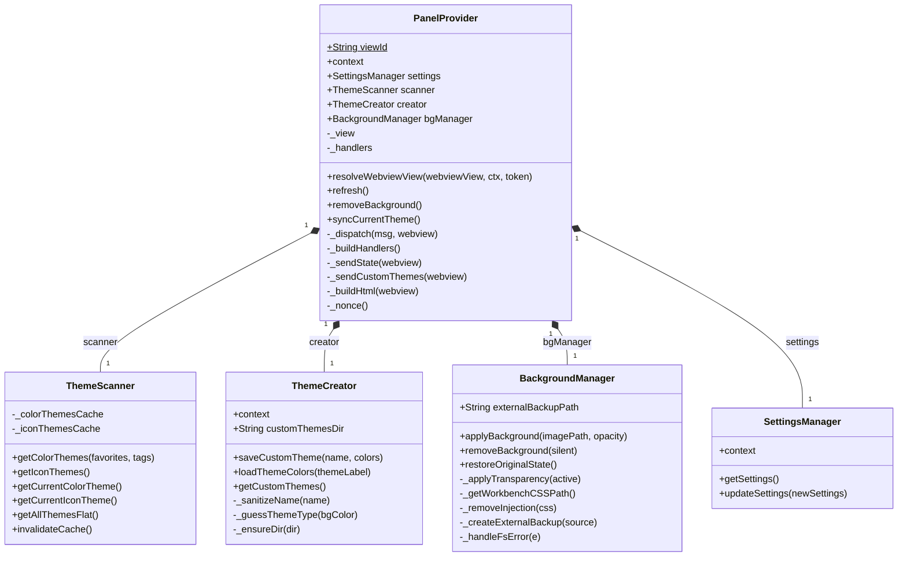
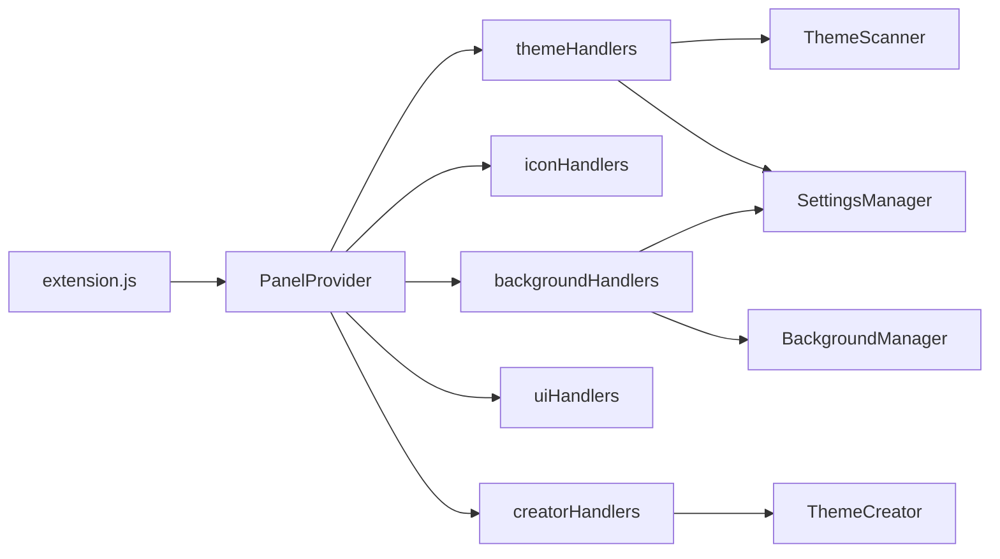
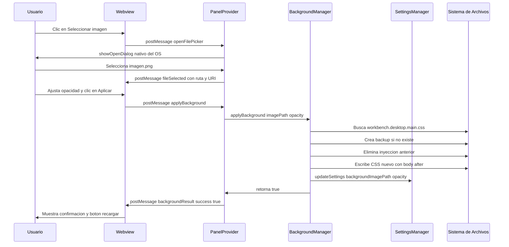
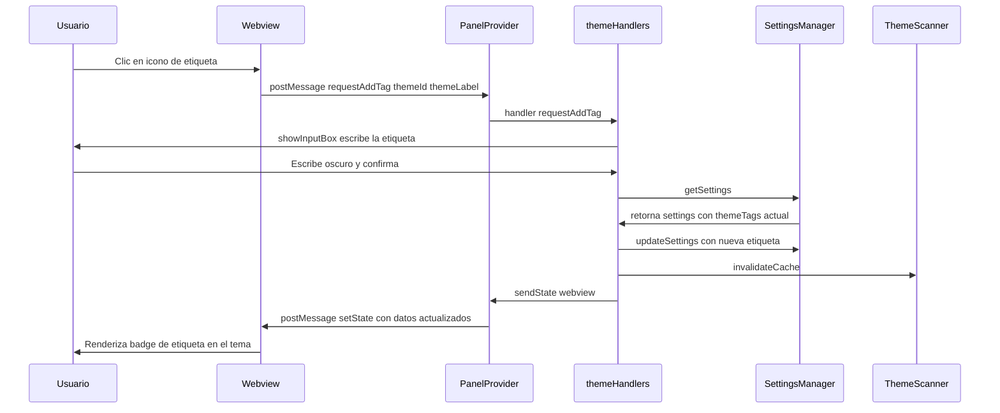

# Arquitectura Técnica — Theme Manager v3.4.0

Este documento describe la arquitectura interna del proyecto para desarrolladores que quieran entender, mantener o extender el código.

---

## Principios de Diseño

El proyecto sigue tres principios que guían todas las decisiones de diseño. El primero es la **Responsabilidad Única (SRP)**: cada módulo tiene exactamente una razón para cambiar. `BackgroundManager` cambia solo si cambia la forma en que VS Code gestiona su CSS. `ThemeCreator` cambia solo si cambia el formato de los temas JSON. Mezclar estas responsabilidades fue el error original que se corrigió en la refactorización v3.4.0.

El segundo principio es la **Inyección de Dependencias**: los handlers no crean sus propias dependencias, las reciben como argumentos desde `PanelProvider._buildHandlers()`. Esto hace que el código sea testeable en aislamiento y que el punto de conexión esté en un único lugar, visible y explícito.

El tercero es **Separación UI / Lógica**: el webview (HTML/CSS/JS) no toma ninguna decisión de negocio. Solo muestra estado y envía mensajes. Toda la lógica vive en el Extension Host (Node.js), donde tiene acceso completo a las APIs de VS Code y al sistema de archivos.

---

## Diagrama de Clases

El siguiente diagrama muestra todas las clases del proyecto, sus propiedades, métodos (públicos y privados) y las relaciones de composición entre ellas.

---

## Referencia de Métodos por Módulo

### `PanelProvider` — El Orquestador

Es el único módulo que implementa la interfaz `WebviewViewProvider` de VS Code. No contiene lógica de negocio: su responsabilidad es conectar las piezas y gestionar el ciclo de vida del panel.

| Método | Visibilidad | Descripción |
|---|---|---|
| `resolveWebviewView(webviewView, ctx, token)` | pública | Llamado por VS Code al abrir el panel por primera vez. Configura las opciones del webview, carga el HTML, registra listeners y envía el estado inicial. |
| `refresh()` | pública | Invocado desde `extension.js` cuando el usuario ejecuta el comando `themeManager.refresh`. Reenvía el estado completo al webview. |
| `removeBackground()` | pública | Invocado desde el comando `themeManager.removeBackground` de la paleta. Delega a `BackgroundManager`. |
| `syncCurrentTheme()` | pública | Invocado cuando `vscode.workspace.onDidChangeConfiguration` detecta un cambio externo de tema. Notifica al webview para sincronizar el badge del tema activo. |
| `_dispatch(msg, webview)` | privada | Punto de entrada único para todos los mensajes del webview. Busca el handler en `_handlers` y lo ejecuta. Si el comando no existe, lo registra en `console.warn`. |
| `_buildHandlers()` | privada | Fusiona los 5 módulos de handlers con `Object.assign()`. Aquí se añaden nuevos dominios. Cada fábrica recibe solo las dependencias que necesita. |
| `_sendState(webview)` | privada | Construye y envía el payload completo de estado: grupos de temas, iconos, tema activo, configuración actual del IDE, ruta del fondo, opacidad y versión. |
| `_sendCustomThemes(webview)` | privada | Versión reducida de `_sendState`: solo actualiza la lista de temas personalizados. Más eficiente para el handler `saveCustomTheme`. |
| `_buildHtml(webview)` | privada | Lee `index.html` desde disco y reemplaza los marcadores `{{nonce}}`, `{{cssUri}}`, `{{jsUri}}` y `{{cspSource}}` con sus valores reales mediante regex globales. |
| `_nonce()` | privada | Genera una cadena de 32 caracteres alfanuméricos aleatorios para usarla como nonce de la CSP. Único por sesión del webview. |

---

### `ThemeScanner` — El Indexador

Itera sobre `vscode.extensions.all` para extraer metadatos de temas e iconos. Implementa un caché de dos niveles (color e iconos) que se invalida automáticamente cuando se instala o desinstala una extensión.

| Método | Visibilidad | Descripción |
|---|---|---|
| `getColorThemes(favorites, tags)` | pública | Escanea todas las extensiones en busca de entradas `contributes.themes`. Devuelve un array de grupos `{ extensionName, themes[] }`. Cada tema incluye si es favorito y sus etiquetas. Incluye los temas personalizados del usuario bajo el grupo `⭐ Mis Temas`. Usa caché si ya se escaneó antes. |
| `getIconThemes()` | pública | Escanea `contributes.iconThemes` de todas las extensiones. Devuelve un array plano de iconos ordenados alfabéticamente. Usa caché. |
| `getCurrentColorTheme()` | pública | Lee `workbench.colorTheme` de la configuración global de VS Code. |
| `getCurrentIconTheme()` | pública | Lee `workbench.iconTheme` de la configuración global de VS Code. |
| `getAllThemesFlat()` | pública | Aplana todos los grupos de `getColorThemes()` en un array plano. Usado por el webview para construir el selector de temas del Creator. |
| `invalidateCache()` | pública | Pone `_colorThemesCache` e `_iconThemesCache` en `null`, forzando un re-escaneo en la próxima llamada. **Debe usarse siempre en lugar de acceder a las propiedades directamente.** |

---

### `ThemeCreator` — El Gestor de JSON

Solo gestiona archivos JSON de temas personalizados y su registro en la configuración de VS Code. No tiene ninguna relación con CSS ni fondos de pantalla (esa responsabilidad pertenece a `BackgroundManager`).

| Método | Visibilidad | Descripción |
|---|---|---|
| `saveCustomTheme(name, colors)` | pública | Serializa el mapa de colores a un archivo JSON compatible con VS Code en `globalStorageUri/custom-themes/`. Registra el tema en `themeManager.customThemes` para que persista entre sesiones. Llama a `_guessThemeType` para determinar si el tema es `dark` o `light`. |
| `loadThemeColors(themeLabel)` | pública | Busca el archivo `.json` de un tema instalado por su label. Lo lee, elimina los comentarios `//` y `/* */` (que son JSON inválido) con regex, y lo parsea. Devuelve el objeto del tema o `null` si no lo encuentra. |
| `getCustomThemes()` | pública | Lee `themeManager.customThemes` de la configuración global. Devuelve un array de `{ name, path }`. |
| `_sanitizeName(name)` | privada | Reemplaza caracteres no permitidos en nombres de archivo, dejando solo alfanuméricos, guiones y letras con acento. Convierte espacios en guiones. |
| `_guessThemeType(bgColor)` | privada | Calcula la luminancia del color de fondo usando la fórmula YIQ: `0.299R + 0.587G + 0.114B`. Si es menor a 128, el tema es `dark`; si no, `light`. |
| `_ensureDir(dir)` | privada | Crea el directorio `custom-themes/` si no existe, usando `fs.mkdirSync` con `recursive: true`. Llamado en el constructor. |

---

### `BackgroundManager` — El Inyector de CSS

El módulo más delicado del proyecto. Localiza y modifica `workbench.desktop.main.css`, el archivo CSS interno de VS Code. Delimita sus inyecciones con marcadores únicos para poder localizarlas y eliminarlas con precisión quirúrgica.

| Método | Visibilidad | Descripción |
|---|---|---|
| `applyBackground(imagePath, opacity)` | pública | Localiza el CSS del workbench, crea un backup externo si no existe, elimina cualquier inyección anterior para evitar duplicados, inyecta el bloque CSS nuevo con `body::after` y llama a `_applyTransparency(true)`. Devuelve `true` si tuvo éxito. |
| `removeBackground(silent)` | pública | Lee el CSS del workbench, elimina el bloque inyectado, llama a `_applyTransparency(false)`. Si `silent` es `false`, muestra un diálogo preguntando si recargar VS Code. |
| `restoreOriginalState()` | pública | Alias semántico que llama a `removeBackground(true)`. Usado por el Master Switch y por `deactivate()` en `extension.js`. |
| `_applyTransparency(active)` | privada | Actualiza `workbench.colorCustomizations` en la configuración global de VS Code. Si `active=true`, pone el fondo de editor, sidebar, terminal y tabs en `#00000000` (transparente) para que la imagen de `body::after` sea visible. Si `active=false`, limpia el objeto de customizaciones completamente. |
| `_getWorkbenchCSSPath()` | privada | Prueba tres rutas candidatas conocidas de `workbench.desktop.main.css` usando `vscode.env.appRoot` como base. VS Code no expone esta ruta por API pública, por lo que se usan heurísticas. Devuelve la primera ruta que existe, o `null`. |
| `_removeInjection(css)` | privada | Encuentra el bloque entre `INJECTION_MARKER_START` y `INJECTION_MARKER_END` usando `indexOf`. Incluye el `\n` previo al marcador para no acumular líneas vacías con cada aplicación. |
| `_createExternalBackup(source)` | privada | Copia el CSS original a `~/Documents/ThemeManager_CSS_Backup_ORIGINAL.css` una única vez (si el archivo de backup no existe todavía). |
| `_handleFsError(e)` | privada | Distingue entre errores de permisos (`EACCES`, `EPERM`) y errores genéricos, mostrando mensajes de error distintos al usuario vía `vscode.window.showErrorMessage`. |

---

### `SettingsManager` — La Persistencia

Abstracción delgada sobre `vscode.workspace.getConfiguration('themeManager')`. Centraliza todas las lecturas y escrituras de la configuración de la extensión.

| Método | Visibilidad | Descripción |
|---|---|---|
| `getSettings()` | pública | Lee todos los settings de `themeManager.*` y los devuelve como un objeto plano. `masterSwitchActive` usa `!== false` como default para que sea `true` cuando el setting no existe aún. |
| `updateSettings(newSettings)` | pública | Recibe un objeto parcial y actualiza solo las claves presentes. Cada clave se escribe en `ConfigurationTarget.Global` de forma asíncrona. Devuelve `true` si tuvo éxito. |

---

## Diagrama de Dependencias entre Módulos

---

## Flujo Completo: Aplicar una Imagen de Fondo

Este es el flujo más complejo del sistema, ya que involucra al usuario, al webview, al Extension Host, al sistema de archivos y a VS Code.

---

## Flujo: Agregar una Etiqueta a un Tema

---

## Seguridad (Content Security Policy)

El webview de VS Code es un entorno con CSP estricta. Las reglas aplicadas son:

| Directiva | Valor | Razón |
|---|---|---|
| `default-src` | `'none'` | Denegar todo por defecto |
| `style-src` | `{{cspSource}} 'unsafe-inline'` | Permitir el CSS externo y estilos inline de VS Code |
| `script-src` | `'nonce-{{nonce}}'` | Solo el script con el nonce generado por sesión |
| `img-src` | `{{cspSource}} data: vscode-file: file:` | Permitir imágenes del sistema de archivos |
| `font-src` | `{{cspSource}} data:` | Permitir fuentes del paquete de la extensión |

El nonce se genera con 32 caracteres aleatorios en cada llamada a `_buildHtml()`. Esto garantiza que no sea predecible y que sea único por sesión del webview.

---

## Ciclo de Vida del Webview

VS Code puede destruir y recrear el webview cuando el panel queda oculto para liberar memoria. La opción `retainContextWhenHidden: true` en `extension.js` evita esto: el webview se mantiene en memoria aunque no sea visible. Sin esta opción, el usuario perdería el estado local del panel (ej. la imagen seleccionada pero no aplicada) cada vez que cambia de pestaña en la barra de actividad.

Cuando el panel recupera visibilidad, `onDidChangeVisibility` dispara `_sendState()` para sincronizar cualquier cambio externo (ej. el usuario cambió el tema desde la paleta de comandos directamente).
